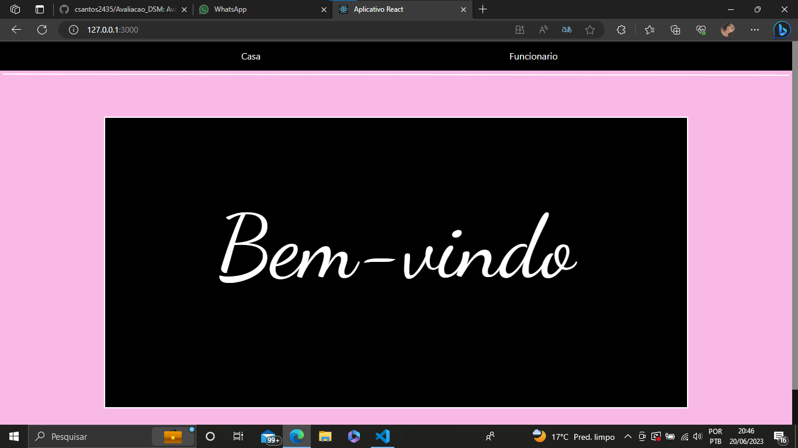
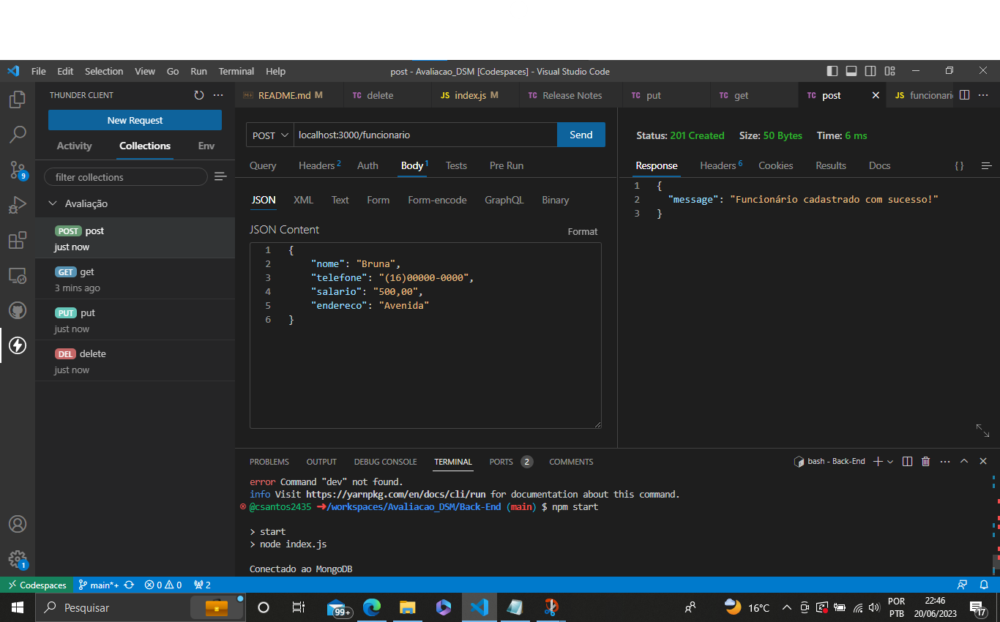
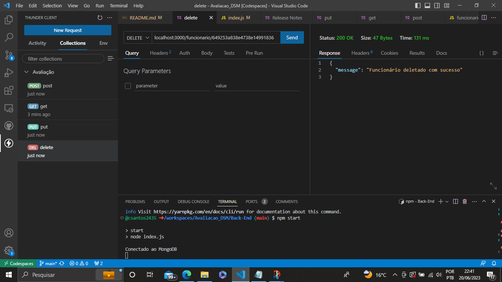

# Avaliacao_DSM
Avaliação - Desenvolvimento Web III

FRONT-END

COMANDOS -
1º cd front-end
2º npm start

Telas:

BACK-END

COMANDO -
1º cd Back-End
2º npm start

Tela :

Post

Get

Put

Delete

Tela do Banco - MongoDB

